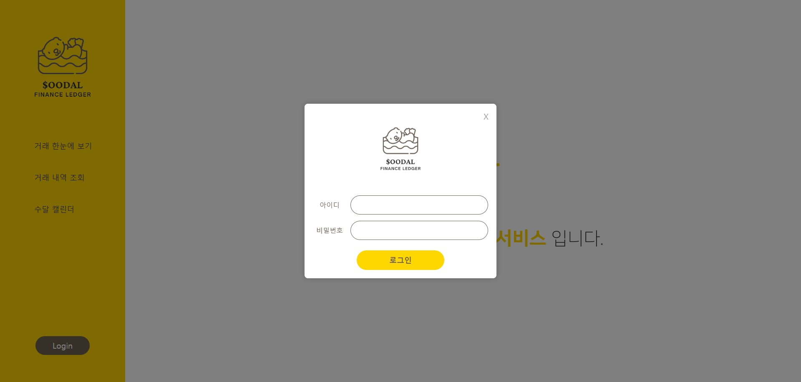
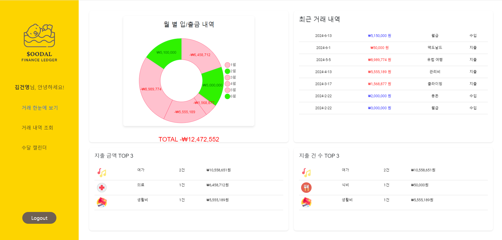
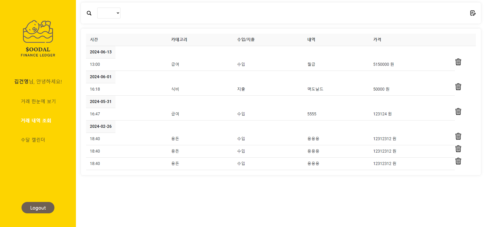
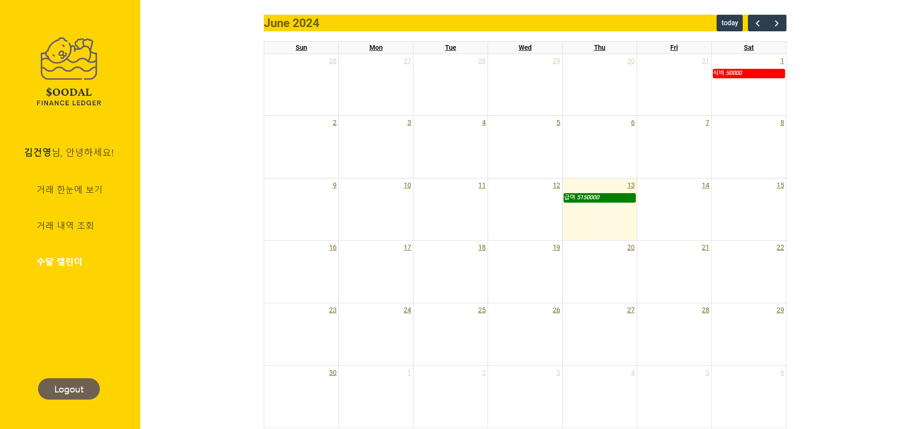

# SOODAL


>“**수**입이 얼마일까 이번 **달**은?”

수달($OODAL)은 KB IT’s Your Life에서 진행하는 스켈레톤 프로젝트로 vue를 활용하여 개발한 개인 가계부 웹 서비스입니다.

사용자는 **거래 한눈에 보기** 기능으로 월별 수입/지출 그래프, 최근 거래 내역, 지출 금액과 건수 TOP3 항목을 확인할 수 있습니다. 두 번째로 **거래 내역 조회** 페이지에서 전체 거래 내역을 조회, 추가, 삭제 할 수 있습니다. 카테고리 별로 정렬하여 조회도 가능합니다. 마지막으로 **수달 캘린더** 페이지에서는 캘린더에서 한눈으로 수입과 지출 항목을 확인할 수 있습니다.


## Recommended IDE Setup

[VSCode](https://code.visualstudio.com/) + [Volar](https://marketplace.visualstudio.com/items?itemName=Vue.volar) (and disable Vetur).

## Customize configuration

See [Vite Configuration Reference](https://vitejs.dev/config/).

## Project Setup

```sh
npm install
```

### Compile and Hot-Reload for Development

```sh
npm run dev
```

### Compile and Minify for Production

```sh
npm run build
```

## JSON-SERVER DATA
```
{
  "data": [
    {
      "id": 0,
      "member_id": "admin",
      "member_pwd": "admin",
      "member_name": "김건영",
      "email": "admin@admin.com",
      "date": "2024-06-13",
      "time": "13:00",
      "type": "수입",
      "category": "급여",
      "amount": "5150000",
      "memo": "월급"
    }
  ]
}
```
data라는 이름을 가지는 jSON 데이터 아래로 **id값이 PK**

## Project Structure
```
📦src
 ┣ 📂assets
 ┃ ┣ 📜base.css
 ┃ ┣ 📜logo.svg
 ┃ ┗ 📜main.css
 ┣ 📂components
 ┃ ┣ 📜.DS_Store
 ┃ ┣ 📜AddList.vue
 ┃ ┣ 📜Calendar.vue
 ┃ ┣ 📜CountTop.vue
 ┃ ┣ 📜DoughnutChart.vue
 ┃ ┣ 📜ExpenseList.vue
 ┃ ┣ 📜IncomeList.vue
 ┃ ┣ 📜List.vue
 ┃ ┣ 📜ListHeader.vue
 ┃ ┣ 📜LoginGuide.vue
 ┃ ┣ 📜LoginModal.vue
 ┃ ┣ 📜LoginReminderModal.vue
 ┃ ┣ 📜Main.vue
 ┃ ┣ 📜PayTop.vue
 ┃ ┣ 📜RecentContract.vue
 ┃ ┗ 📜sidebar.vue
 ┣ 📂router
 ┃ ┗ 📜index.js
 ┣ 📜.DS_Store
 ┣ 📜App.vue
 ┗ 📜main.js
```

## Technical Stack


## Web Preview 






## Contributor
- 전공 B반 주정윤, [github](https://github.com/JOLLA99)
- 전공 B반 김건영,  
- 전공 B반 권초원, 
